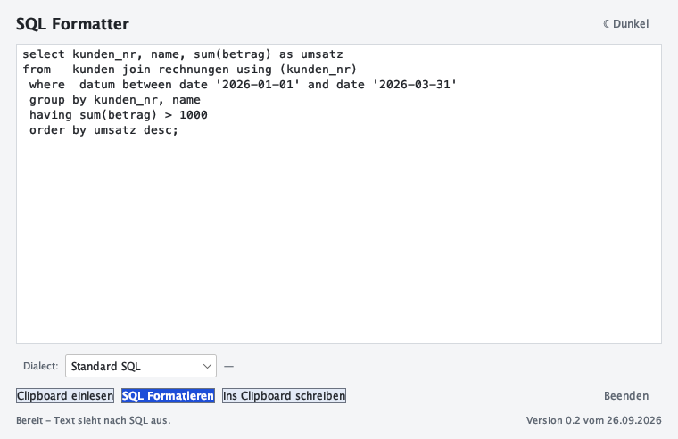

# Anleitung für macOS

Diese Anleitung richtet sich an alle, die den SQL Clipboard Formatter auf einem
Mac benutzen wollen. Sie setzt keine Programmierkenntnisse voraus — nur ein
Terminal, in das Sie einen Befehl eintippen können.

> **Sie suchen die Anleitung für Windows?** Dann nehmen Sie
> [anleitung-windows.md](anleitung-windows.md). Dort gibt es ein fertiges ZIP,
> in dem die Java-Laufzeit bereits enthalten ist — auf dem Mac ist Java
> Voraussetzung, weil es dafür kein ZIP gibt.

> ### Falls bei Ihnen eine mitgelieferte Laufzeit liegt
>
> `start.sh` nimmt, falls vorhanden, ein Java aus einem Ordner `jre/` neben
> dem Skript — auf dem Mac liegt normalerweise keiner, dann greift Ihr
> installiertes Java. `start.sh -Pruefen` sagt Ihnen in jedem Fall, welches
> Java verwendet wird und woher es stammt. Näheres dazu steht im README.

---

## 1. Wofür ist das Programm?

Sie markieren SQL-Text in einem beliebigen Programm, kopieren ihn mit Cmd+C in
die Zwischenablage und formatieren ihn mit einem Klick:

```
select a,b,c from tabelle where b=1 and c=2 order by a;
```

wird zu:

```sql
SELECT
    a,
    b,
    c
FROM
    tabelle
WHERE
    b = 1
    AND c = 2
ORDER BY
    a;
```

Das Ergebnis liegt danach wieder in der Zwischenablage, sodass Sie es mit
Cmd+V an die gewünschte Stelle setzen können. Sie brauchen dafür **kein
Datenbankprogramm und keine Internetverbindung**.

## 2. Was Sie brauchen

| | |
|---|---|
| **Java 17 oder neuer** | zwingend — das Programm ist in Java geschrieben |
| **Maven** | nur nötig, wenn Sie das Programm **selbst übersetzen** wollen; zum Benutzen nicht nötig |

Maven können Sie sich sparen: Wenn das Programm einmal übersetzt wurde, startet
es auch ohne Maven. Das ist auf diesem Weg geprüft — ohne Maven im Suchpfad und
mit vorhandener Programmdatei startet es trotzdem.

## 3. Schritt 1: Java prüfen

Öffnen Sie das Terminal über **Finder → Programme → Dienstprogramme →
Terminal** (oder Cmd+Leertaste, „Terminal" eintippen, Enter) und geben Sie ein:

```sh
java -version
```

Sieht die Antwort so oder ähnlich aus, ist alles in Ordnung:

```
openjdk version "27" 2026-09-15
OpenJDK Runtime Environment (build 27+35-2325)
```

Steht dort `zsh: command not found: java` oder eine Versionszahl unter 17, fehlt
Java oder ist zu alt. Installieren Sie es über [Azul Zulu](https://azul.com/downloads/)
(„JDK", macOS, Apple Silicon oder Intel) und starten Sie das Terminal neu.

## 4. Schritt 2: Das Programm holen

Wechseln Sie in einen Ordner, in dem das Programm liegen darf, und holen Sie
es mit Git:

```sh
git clone https://github.com/martindobronski/sqlClipboardFormatter.git
cd sqlClipboardFormatter
```

Danach übersetzen Sie es einmal. Das dauert beim ersten Mal etwa eine Minute
und lädt einige Dateien nach:

```sh
./start.sh -Neu
```

Der Build ist durch, wenn `BUILD SUCCESS` steht.

## 5. Schritt 2: Programm starten

Ab jetzt genügt immer dieser eine Befehl:

```sh
./start.sh
```

Das Fenster **SQL Clipboard Formatter** öffnet sich. Das Skript baut vorher
automatisch neu, falls Sie oder jemand an den Quellen etwas geändert hat — Sie
müssen das also nicht selbst entscheiden.

### Ohne Terminal: Start per Doppelklick

Wenn Sie lieber nicht jedes Mal einen Befehl eintippen, machen Sie sich eine
Doppelklick-Datei. Die ist lediglich eine Kopie desselben Skripts unter einem
Namen, den der Finder per Doppelklick öffnet:

```sh
cp start.sh start.command
chmod +x start.command
```

Ab jetzt startet ein **Doppelklick auf `start.command` im Finder** das Programm.

Geprüft ist, dass `start.command` korrekt läuft — als ausführbare Datei wurde
sie auf diesem Weg gestartet, das Fenster ging auf. Der Klick selbst im Finder
konnte hier nicht per Maus ausgeführt werden; er ruft denselben Befehl auf, den
Sie in Schritt 5 getippt haben. Sollte der Finder beim ersten Versuch meckern,
nehmen Sie den Weg über das Terminal.

### Was die Schalter können

| Befehl | Wirkung |
|---|---|
| `./start.sh` | starten, baut vorher bei Bedarf neu |
| `./start.sh -Neu` | vorher neu übersetzen, auch wenn schon alles aktuell ist |
| `./start.sh -Pruefen` | nur nachsehen, ob die Umgebung passt — startet nichts |
| `./start.sh -Xmx512m` | gibt 512 MB Speicher für das Programm frei |

### Wenn Java oder Maven an einer ungewöhnlichen Stelle liegen

Fast immer findet `start.sh` von selbst das richtige Java. Liegt es bei Ihnen
etwa in einer nicht im Suchpfad enthaltenen Version, tragen Sie den Pfad in
`start.local.conf` ein — eine Datei neben `start.sh`, die **nicht** mit Git
verwaltet wird, weil sie die Pfade Ihres Rechners enthält:

```sh
cp start.conf.example start.local.conf
```

```
java=/usr/local/opt/openjdk@17/bin/java
maven=/usr/local/bin/mvn
maven-jdk=/Library/Java/JavaVirtualMachines/temurin-17.jdk/Contents/Home
```

Anführungszeichen sind nicht nötig, Leerzeichen im Pfad sind in Ordnung, alles
hinter einem `#` ist Kommentar. `maven-jdk` brauchen Sie nur, wenn Maven mit
einem anderen Java übersetzen soll als dem, mit dem die Programm startet; leer
lassen heißt, `JAVA_HOME` bleibt unangetastet.

Ein Eintrag, dessen Pfad es nicht gibt, ist kein Problem: `start.sh` prüft
jeden Pfad und geht dann weiter. `./start.sh -Pruefen` zeigt Ihnen, welcher
Eintrag wirklich benutzt wurde — steht dort `Konfig  : ...` und daneben
`(start.local.conf)`, ist es Ihrer.

## 6. Bedienung



So sieht das Programm beim Start aus. Das dunkle Design erreichen Sie über den
Knopf oben rechts.

Oben steht der Titel **SQL Formatter**, rechts daneben ein Knopf zum Umschalten
zwischen dunkel und hell. Darunter das große Textfeld, rechts daneben die Auswahl
**Dialect:**. Ganz unten die Statuszeile.

### Die Zahlen links im Textfeld

Links im Textfeld stehen Zahlen. Sie zählen die **Zeilen, die Sie gerade sehen**,
nicht die Absätze im Text: Das Feld ist 84 Zeichen breit, und eine längere Zeile
bricht weich um. Bekommt eine Zeile davon zwei Bildschirmzeilen, stehen dort auch
zwei Zahlen.

Das ist der Grund, warum die Zahlen hilfreich sind: Jede Zahl gehört zu genau der
Zeile, die daneben steht — beim Tippen, beim Formatieren und beim Blättern. Die
Statuszeile unten nennt dieselbe Anzahl als „Zeilen".

### Der eine wichtige Punkt: die Statuszeile

**Die Statuszeile ist das Einzige, was Ihnen sagt, ob die Knöpfe etwas tun.**

| Inhalt des Feldes | Statuszeile | Knöpfe |
|---|---|---|
| leer | Bereit - Bitte SQL aus der Zwischenablage laden. | nur *Clipboard einlesen* |
| sieht nach SQL aus | Bereit - Text sieht nach SQL aus. | alle frei |
| sieht nicht nach SQL aus | ⚠ Der Text sieht nicht nach SQL aus. Formatieren und Schreiben sind blockiert. | nur *Clipboard einlesen* |

Genau in diesem letzten Fall sind **SQL Formatieren** und **Ins Clipboard
schreiben** grau. Das ist Absicht: So überschreiben Sie nicht versehentlich einen
normalen Text aus Ihrer Zwischenablage mit SQL, das Sie gar nicht erwartet haben.
**Clipboard einlesen** bleibt immer anklickbar — Sie können also jederzeit nachsehen,
was in der Zwischenablage steht.

### Die vier Knöpfe

| Knopf | Wirkung |
|---|---|
| **Clipboard einlesen** | holt den Text aus Ihrer Zwischenablage in das Feld |
| **SQL Formatieren** | formatiert den Text im Feld |
| **Ins Clipboard schreiben** | legt den Text aus dem Feld in die Zwischenablage |
| **Beenden** | beendet das Programm; steht rechts neben den anderen Knöpfen |

**Das sind zwei Schritte, nicht einer:** *SQL Formatieren* legt nichts in die
Zwischenablage. Erst *Ins Clipboard schreiben* tut das. So können Sie sich das
Ergebnis ansehen, bevor Sie es irgendwo einfügen.

### Normaler Arbeitsablauf

1. SQL in Ihrem Programm markieren und mit **Cmd+C** kopieren
2. **Clipboard einlesen** → `✓ Text geladen. Formatieren und Schreiben sind freigeschaltet.`
3. **SQL Formatieren** → `✓ SQL-Text nach Best Practice formatiert.`
4. **Ins Clipboard schreiben** → `✓ SQL erfolgreich in die Zwischenablage kopiert.`
5. In Ihr Programm zurück, **Cmd+V** einfügen

### Wenn die Formatierung nicht durchgreift

> ⚠ Nur normalisiert - Zeilenstruktur unverändert.

Dann erkennt das Programm Ihren Text zwar als SQL, Ihre gewählte Variante
liefert aber kein verlässliches Ergebnis — typischerweise MySQL-Syntax, während
Standard SQL eingestellt ist. Statt zu raten hat es den Text nur vorsichtig in
Ordnung gebracht und die Zeilenumbrüche unangetastet gelassen. Ein anderes
Ergebnis bekommen Sie in der Regel mit einer anderen Einstellung unter
**Dialect:**.

### Die Variante unter „Dialect:"

Für die allermeisten Fälle genügt **Standard SQL**. Wählen Sie eine andere
Variante, wenn Ihr Server eigene Syntax benutzt:

| Auswahl | Für |
|---|---|
| Standard SQL | allgemein, passt für die meisten Datenbanken |
| PostgreSQL | PostgreSQL |
| MySQL / MariaDB | MySQL, MariaDB |
| SQL Server (T-SQL) | Microsoft SQL Server |
| Oracle PL/SQL | Oracle, einschließlich PL/SQL-Blöcken |
| IBM DB2 | IBM DB2 |

Rechts neben der Auswahl steht, was die Wahl für den Text im Feld bewirkt:

| Anzeige | Bedeutung |
|---|---|
| `—` | noch kein Text im Feld |
| Standard SQL genügt | Ihre Ausstellung ist egal, alle Varianten kommen zum gleichen Ergebnis |
| wirksam: PostgreSQL, MySQL | mit diesen Varianten sieht das Ergebnis anders aus — hier lohnt die Wahl |
| Text zu lang, um die Dialekte zu vergleichen. | über 4000 Zeichen wird nicht verglichen. Das ist nur eine Anzeige, **das Formatieren läuft trotzdem** |

### Hell oder dunkel

Der Knopf oben rechts zeigt an, **wohin** Sie wechseln, nicht wo Sie sind: Im
dunklen Design steht dort `☀ Hell`, im hellen `☾ Dunkel`. Ein Klick schaltet um.
Die Wahl gilt für diese Sitzung; beim nächsten Start ist es wieder hell. Das
Programm merkt sich die Einstellung absichtlich nicht.


## 7. Optional: ein Hotkey für den Formatter

Wenn Sie den Formatter oft brauchen, richtet Raycast einen Tastekurzbefehl ein,
mit dem Sie das Fenster jederzeit aufrufen. Voraussetzung ist
[Raycast](https://www.raycast.com/) (kostenlos).

1. Öffnen Sie Raycast und gehen Sie auf **Command + Leertaste**
2. Tippen Sie „Extensions" und drücken Sie Enter
3. Suchen Sie **Script Commands** und öffnen Sie es
4. Klicken Sie auf **Create Script Command**
5. Tragen Sie ein:
   - **Name**: SQL Formatter
   - **Script**: `/Pfad/zu/sqlClipboardFormatter/raycast/start-sql-formatter.sh`
   - **Abkürzung**: etwa `sql`

   Den Pfad finden Sie, indem Sie im Terminal `pwd` eingeben, während Sie im
   Programmordner sind, und `/sqlClipboardFormatter` dahinter setzen.
6. Klicken Sie auf **Save**

Ab jetzt genügt Ihre gewählte Taste, um das Programm zu öffnen. Läuft es
schon, holt der Hotkey das vorhandene Fenster nach vorn, statt ein zweites zu
öffnen.

Dieser Weg ist auf einem Mac mit installiertem Raycast eingerichtet und
ausprobiert worden — beide Fälle, also laufendes und noch nicht laufendes
Programm.

## 8. Wenn etwas nicht klappt

### Der Knopf „Formatieren" ist grau

Die Statuszeile erklärt es: In der Zwischenablage steht kein SQL. Drücken Sie
**Einfügen** und schauen Sie nach, ob die Statuszeile umspringt.

### „error: could not find or load main class" oder „unable to access jarfile"

Das Programm wurde noch nicht übersetzt. Führen Sie einmal aus:

```sh
./start.sh -Neu
```

### „mvn: command not found" beim Bauen

Sie brauchen Maven nur zum Übersetzen. Installieren Sie es mit
[Homebrew](https://brew.sh/): `brew install maven`. Zum reinen Benutzen können
Sie Maven auch wieder deinstallieren, sobald einmal gebaut wurde.

### „./start.sh: Permission denied"

Einmalig die Ausführungsrechte setzen:

```sh
chmod +x start.sh
```

### Der Finder lässt `start.command` nicht öffnen

Das ist die macOS-Sperre für Dateien aus dem Internet. Starten Sie das Programm
in diesem Fall über das Terminal. Alternativ im Finder: Rechtsklick auf
`start.command` → **Öffnen** → im Dialog erneut **Öffnen**.

### Das Fenster öffnet sich, ist aber nicht zu sehen

Es kann hinter dem gerade benutzten Programm liegen. Klicken Sie im Dock auf das
Java-Symbol, oder richten Sie den Raycast-Hotkey aus Schritt 7 ein.

### Was funktioniert, wenn Sie mehr wissen wollen

`./start.sh -Pruefen` sagt Ihnen, welchen Java- und welchen Maven-Pfad das
Programm findet, ob die Programmdatei vorhanden ist und wie viele Argumente an
Java durchgereicht werden:

```
Java    : /usr/bin/java
Konfig  : keine
Maven   : mvn
Jar     : target/SqlClipboardFormatter-0.3.jar (vorhanden)
Bauen   : falls Quellen neuer
Argumente: 0 an die JVM
```

## 9. Was das Programm nicht macht

- **Kein Internet.** Es sendet nichts nach außen. Den SQL-Text sehen nur Sie
  und Ihre Zwischenablage.
- **Keine Datenbankverbindung.** Das Programm kennt SQL nur als Text.
- **Kein Speichern.** Es legt keine Dateien an und liest keine. Was Sie
  formatieren, verlassen Sie nur als kopierter Text die Zwischenablage.
- **Kein Zurück.** Die ursprüngliche Fassung liegt nach dem Formatieren nicht
  mehr in der Zwischenablage — kopieren Sie sie vorher noch einmal, wenn Sie
  beide Fassungen brauchen.

## 10. Wenn Sie den Mac wechseln

Kopieren Sie den Ordner `sqlClipboardFormatter` auf den neuen Rechner. Ist dort
noch kein Java installiert, holen Sie das zuerst nach. Einmal übersetzt läuft
das Programm ohne Maven weiter.

Mehr zum Programm selbst — Bauen, Aufbau, Tests, Versionierung — steht in der
[README](../README.md).
