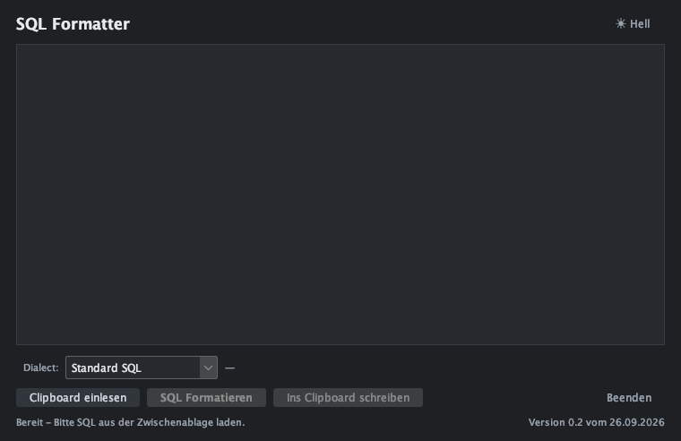

# Anleitung für Windows

Diese Anleitung richtet sich an alle, die den SQL Clipboard Formatter auf einem
Windows-Rechner benutzen wollen. Sie setzt keine Programmierkenntnisse voraus.

> **Sie suchen die Anleitung für einen Mac?** Dann nehmen Sie
> [anleitung-macos.md](anleitung-macos.md).

> ### Stand der Prüfung
> Diese Anleitung ist vollständig aus dem Skript `start.bat` herausgeschrieben
> und an jeder Stelle mit dem Quelltext abgeglichen. Auf einem echten Windows-
> Rechner ist es jedoch **noch nicht durchlaufen** — unter macOS lässt sich kein
> `cmd.exe` ausführen. Die Schritte in Abschnitt 3 und 4 sind deshalb als
> Anleitung formuliert, nicht als bestätigte Erprobung. Wenn etwas abweicht,
> beginnen Sie mit Abschnitt 8; dort steht, wie Sie den Fehlertext zu Gesicht
> bekommen. Der erste sinnvolle Test ist immer `start.bat -Pruefen`.

---

## 1. Wofür ist das Programm?

Sie markieren SQL-Text in einem beliebigen Programm, kopieren ihn mit Strg+C in
die Zwischenablage und formatieren ihn mit einem Klick:

```
select a,b,c from tabelle where b=1 and c=2 order by a;
```

wird zu:

```sql
SELECT
    a,
    b,
    c
FROM
    tabelle
WHERE
    b = 1
    AND c = 2
ORDER BY
    a;
```

Das Ergebnis liegt danach wieder in der Zwischenablage, sodass Sie es mit
Strg+V an die gewünschte Stelle setzen können. Sie brauchen dafür **kein
Datenbankprogramm und keine Internetverbindung**.

## 2. Was Sie brauchen

| | |
|---|---|
| **Java 17 oder neuer** | zwingend — das Programm ist in Java geschrieben |
| **Maven** | nur nötig, wenn Sie das Programm **selbst übersetzen** wollen; zum Benutzen nicht nötig |
| **PowerShell** | ist seit Windows 8 dabei und wird für die Prüfungen benutzt — müssen Sie nichts installieren |

Maven können Sie sich sparen: Ist das Programm einmal übersetzt, startet es
auch ohne Maven. Auf einem Mac ist genau das nachgewiesen worden; im
Windows-Skript ist derselbe Ablauf hinterlegt.

Auf einem Windows-Rechner mit ARM-Prozessor brauchen Sie die ARM-Version von
Java, nicht die für Intel.

## 3. Schritt 1: Java prüfen

Öffnen Sie PowerShell — etwa mit **Win** tippen, „PowerShell" eingeben,
Enter — und prüfen Sie:

```powershell
java -version
```

Sieht die Antwort so oder ähnlich aus, ist alles in Ordnung:

```
openjdk version "17.0.11" 2024-04-16
OpenJDK Runtime Environment (build 17.0.11+9)
```

Kommt stattdessen ein Fehler wie *Der Befehl "java" ist nicht
erkannt* oder *'java' is not recognized*, fehlt Java oder es ist zu alt.
Installieren Sie es über [Azul Zulu](https://azul.com/downloads/)
(„JDK", Windows, x64 oder ARM64).

## 4. Schritt 2: Das Programm holen und starten

Wechseln Sie in einen Ordner, in dem das Programm liegen darf. Eine
PowerShell öffnet zum Beispiel in Ihrem Benutzerordner, was passt. Dann:

```powershell
git clone https://github.com/martindobronski/sqlClipboardFormatter.git
cd sqlClipboardFormatter
```

### Erst prüfen, dann übersetzen

Bevor Sie zum ersten Mal starten, prüfen Sie die Umgebung. Das ist die schnellste
Art herauszufinden, woran es liegt:

```bat
start.bat -Pruefen
```

Sie sehen dann zum Beispiel:

```
Java    : C:\Program Files\Java\jdk-17\bin\java.exe
Maven   : mvn
Jar     : target\SqlClipboardFormatter-0.2.jar - fehlt
Bauen   : ja
Argumente: 0 an die JVM
```

Die Zeilen bedeuten:

| Zeile | Bedeutung |
|---|---|
| `Java` | gefundenes Java. „Fehler: kein Java gefunden" heißt: zurück zu Schritt 1 |
| `Maven` | gefundenes Maven oder „nicht gefunden". Fehlt es, ist das beim ersten Übersetzen ein Problem, später nicht mehr |
| `Jar` | die übersetzte Programmdatei. „fehlt" ist beim ersten Mal normal |
| `Bauen` | ob beim Starten übersetzt werden muss |
| `Argumente` | was an Java durchgereicht wird |

Steht bei `Jar` **fehlt**, übersetzen Sie einmal:

```powershell
.\start.bat -Neu
```

Das dauert beim ersten Mal etwa eine Minute, weil dabei Dateien nachgeladen
werden.

## 5. Schritt 3: Starten

Ab jetzt genügt ein Doppelklick auf **`start.bat`** im Explorer. Oder in der
PowerShell:

```powershell
.\start.bat
```

Das Skript übersetzt vorher automatisch neu, falls es nötig ist, und startet
danach das Programm.

> **Wichtig:** Das Programm läuft im selben schwarzen Fenster, aus dem Sie es
> gestartet haben — dieses Fenster bleibt offen und im Vordergrund, das
> Programmfenster liegt dahinter. Das ist beabsichtigt: Schließen Sie das
> schwarze Fenster, beendet sich auch das Programm. Beenden Sie das Programm
> also über dessen eigenes Fenster.

### Was die Schalter können

| Befehl | Wirkung |
|---|---|
| `start.bat` | starten, übersetzt vorher bei Bedarf neu |
| `start.bat -Neu` | vorher neu übersetzen, auch wenn schon alles aktuell ist |
| `start.bat -Pruefen` | nur nachsehen, ob die Umgebung passt — startet nichts |
| `start.bat -Xmx512m` | gibt 512 MB Speicher für das Programm frei |

## 6. Bedienung



Oben steht der Titel **SQL Formatter**, rechts daneben ein Knopf zum Umschalten
zwischen dunkel und hell. Darunter das große Textfeld, rechts daneben die Auswahl
**Dialect:**. Ganz unten die Statuszeile.

### Der eine wichtige Punkt: die Statuszeile

**Die Statuszeile ist das Einzige, was Ihnen sagt, ob die Knöpfe etwas tun.**

| Inhalt des Feldes | Statuszeile | Knöpfe |
|---|---|---|
| leer | Bereit - Bitte SQL aus der Zwischenablage laden. | nur *Clipboard einlesen* |
| sieht nach SQL aus | Bereit - Text sieht nach SQL aus. | alle frei |
| sieht nicht nach SQL aus | ⚠ Der Text sieht nicht nach SQL aus. Formatieren und Schreiben sind blockiert. | nur *Clipboard einlesen* |

Genau in diesem letzten Fall sind **SQL Formatieren** und **Ins Clipboard
schreiben** grau. Das ist Absicht: So überschreiben Sie nicht versehentlich einen
normalen Text aus Ihrer Zwischenablage mit SQL, das Sie gar nicht erwartet haben.
**Clipboard einlesen** bleibt immer anklickbar — Sie können also jederzeit nachsehen,
was in der Zwischenablage steht.

### Die vier Knöpfe

| Knopf | Wirkung |
|---|---|
| **Clipboard einlesen** | holt den Text aus Ihrer Zwischenablage in das Feld |
| **SQL Formatieren** | formatiert den Text im Feld |
| **Ins Clipboard schreiben** | legt den Text aus dem Feld in die Zwischenablage |
| **Beenden** | beendet das Programm; steht rechts neben den anderen Knöpfen |

**Das sind zwei Schritte, nicht einer:** *SQL Formatieren* legt nichts in die
Zwischenablage. Erst *Ins Clipboard schreiben* tut das. So können Sie sich das
Ergebnis ansehen, bevor Sie es irgendwo einfügen.

### Normaler Arbeitsablauf

1. SQL in Ihrem Programm markieren und mit **Strg+C** kopieren
2. **Clipboard einlesen** → `✓ Text geladen. Formatieren und Schreiben sind freigeschaltet.`
3. **SQL Formatieren** → `✓ SQL-Text nach Best Practice formatiert.`
4. **Ins Clipboard schreiben** → `✓ SQL erfolgreich in die Zwischenablage kopiert.`
5. In Ihr Programm zurück, **Strg+V** einfügen

### Wenn die Formatierung nicht durchgreift

> ⚠ Nur normalisiert - Zeilenstruktur unverändert.

Dann erkennt das Programm Ihren Text zwar als SQL, Ihre gewählte Variante
liefert aber kein verlässliches Ergebnis — typischerweise MySQL-Syntax, während
Standard SQL eingestellt ist. Statt zu raten hat es den Text nur vorsichtig in
Ordnung gebracht und die Zeilenumbrüche unangetastet gelassen. Ein anderes
Ergebnis bekommen Sie in der Regel mit einer anderen Einstellung unter
**Dialect:**.

### Die Variante unter „Dialect:"

Für die allermeisten Fälle genügt **Standard SQL**. Wählen Sie eine andere
Variante, wenn Ihr Server eigene Syntax benutzt:

| Auswahl | Für |
|---|---|
| Standard SQL | allgemein, passt für die meisten Datenbanken |
| PostgreSQL | PostgreSQL |
| MySQL / MariaDB | MySQL, MariaDB |
| SQL Server (T-SQL) | Microsoft SQL Server |
| Oracle PL/SQL | Oracle, einschließlich PL/SQL-Blöcken |
| IBM DB2 | IBM DB2 |

Rechts neben der Auswahl steht, was die Wahl für den Text im Feld bewirkt:

| Anzeige | Bedeutung |
|---|---|
| `—` | noch kein Text im Feld |
| Standard SQL genügt | Ihre Ausstellung ist egal, alle Varianten kommen zum gleichen Ergebnis |
| wirksam: PostgreSQL, MySQL | mit diesen Varianten sieht das Ergebnis anders aus — hier lohnt die Wahl |
| Text zu lang, um die Dialekte zu vergleichen. | über 4000 Zeichen wird nicht verglichen. Das ist nur eine Anzeige, **das Formatieren läuft trotzdem** |

### Zeilenumbrüche: Windows bleibt Windows

Das Programm behält den Zeilenumbruch-Stil, den Ihr Text schon hatte. Kommt Ihr
SQL aus Windows-Programmen, bleiben die Umbrüche, wie sie im Editor stehen:
`CRLF` — ein Wagenrücklauf gefolgt von einem Zeilenvorschub, dargestellt als
`0D 0A`.

Dasselbe gilt für den Text, den das Programm zurückschreibt: Es wandelt nichts
um, nur weil es bequemer wäre.

So prüfen Sie, was in Ihrer Datei wirklich steht:

| Editor | Wo Sie es sehen |
|---|---|
| **Notepad++** | *Ansicht → Symbol anzeigen → Zeilenende anzeigen* |
| **Visual Studio Code** | die Anzeige `CRLF` oder `LF` unten in der Statusleiste, nach einem Klick auf die Datei |

### Hell oder dunkel

Der Knopf oben rechts zeigt an, **wohin** Sie wechseln, nicht wo Sie sind: Im
dunklen Design steht dort `☀ Hell`, im hellen `☾ Dunkel`. Ein Klick schaltet um.
Die Wahl gilt für diese Sitzung; beim nächsten Start ist es wieder dunkel.

## 7. Optional: Schnellzugriff über eine Tastenkombination

Wenn Sie den Formatter oft brauchen, können Sie den Start an eine Taste binden:

1. Im Explorer mit der rechten Maustaste auf `start.bat` klicken
2. **Eigenschaften** öffnen
3. Unter **Kurzbefehl** in das Feld „Verknüpfung" eine Tastenkombination eintippen,
   etwa `Strg+Alt+S`
4. Mit **Übernehmen** schließen

Ab sofort startet die Kombination das Programm.

> Der erste Start hängt davon ab, wie schnell Ihr Rechner ist — beim ersten Mal
> wird übersetzt, das dauert einen Moment. Danach geht es schnell.

## 8. Wenn etwas nicht klappt

### Der erste Schritt: aus einem Fenster heraus starten

Der wichtigste Rat für Windows: Starten Sie das Skript **in einem Fenster**, nicht
per Doppelklick. Dann sehen Sie jede Meldung.

In der **PowerShell**:

```powershell
cd C:\Pfad\zu\sqlClipboardFormatter
.\start.bat -Pruefen
```

Was Sie dort sehen, sagt fast immer, woran es liegt. Die Meldungen, die das
Skript ausgibt:

| Meldung | Ursache |
|---|---|
| `Fehler: kein Java gefunden. Java 17 oder neuer installieren.` | Java fehlt oder ist zu alt — Schritt 3 |
| `Fehler: Version in der pom.xml nicht gefunden.` | `pom.xml` fehlt oder ist beschädigt — der Ordner ist unvollständig |
| `Fehler: Jar fehlt oder ist veraltet, aber weder mvnw.cmd noch mvn gefunden.` | Maven fehlt, obwohl noch nicht übersetzt wurde |
| `Fehler: der Build ist fehlgeschlagen.` | Beim Übersetzen ging etwas schief — die ausführliche Meldung steht darüber |
| `Fehler: "target\SqlClipboardFormatter-0.2.jar" fehlt trotz Bauvorgang.` | Der Build hat nichts erzeugt. Im Namen steckt die Versionsnummer, sie wandert mit jedem Versionswechsel mit |

### „Java wurde nicht gefunden", obwohl Java installiert ist

Das Skript sucht zuerst in `JAVA_HOME` und dann im Suchpfad. Ist Java an einer
anderen Stelle installiert, setzen Sie `JAVA_HOME` — oder nehmen Sie Java in den
Suchpfad auf:

```powershell
[Environment]::SetEnvironmentVariable("JAVA_HOME", "C:\Program Files\Java\jdk-17", "User")
```

Danach PowerShell neu öffnen. Der Pfad muss auf den Ordner zeigen, in dem
`bin` liegt, **nicht** auf die `java.exe`.

### „mvn" wird nicht gefunden, obwohl Maven installiert ist

Legt Sie Maven am besten in einen Ordner **ohne Leerzeichen**, zum Beispiel
`C:\tools\maven`, und tragen Sie ihn in den Suchpfad ein. Grund: Der Pfad zu
Maven wird im Skript unquotiert an das Kommando gereicht, und ein Pfad wie
`C:\Program Files\apache-maven-3.9.9\bin\mvn.cmd` bricht dabei auseinander.
Über den Suchpfad gefunden lautet der Eintrag schlicht `mvn` — damit ist das
Problem nicht vorhanden.

### Beim Schließen des schwarzen Fensters: „Terminate batch job (Y/N)?"

Wenn Sie das schwarze Fenster schließen, während das Programm läuft, fragt
Windows das. Antworten Sie mit **N** oder **J** — je nachdem, ob Sie das
Programm behalten wollen. Besser: beenden Sie über das Programmfenster selbst.

### „unrecognized option" beim Start

Dann steht ein Schalter an falscher Stelle. Die beiden eigenen Schalter
`-Neu` und `-Pruefen` gehören **an den Anfang**, alles andere (zum Beispiel
Speicherangaben) dahinter:

```powershell
.\start.bat -Pruefen -Xmx512m
```

### Der Knopf „Formatieren" ist grau

Die Statuszeile erklärt es: In der Zwischenablage steht kein SQL. Drücken Sie
**Einfügen** und schauen Sie nach, ob die Statuszeile umspringt.

### „error: could not find or load main class" oder „unable to access jarfile"

Das Programm wurde noch nicht übersetzt. Führen Sie einmal aus:

```powershell
.\start.bat -Neu
```

### Das Programmfenster öffnet sich, ist aber nicht zu sehen

Es kann hinter dem gerade benutzten Programm liegen. Starten Sie es über die
Tastenkombination aus Abschnitt 7 erneut — liegt es noch offen, kommt es nach
vorn, statt ein zweites zu öffnen.

### Windows blockiert das Skript

Kommt die Meldung eines Virensenscanners, ist das eine Fehlmeldung: `start.bat`
ist eine reine Textdatei, die Java startet. Starten Sie es in dem Fall aus dem
Explorer heraus mit **Rechtsklick → Ausführen** oder in der PowerShell, wie in
Abschnitt 8 beschrieben.

## 9. Was das Programm nicht macht

- **Kein Internet.** Es sendet nichts nach außen. Den SQL-Text sehen nur Sie
  und Ihre Zwischenablage.
- **Keine Datenbankverbindung.** Das Programm kennt SQL nur als Text.
- **Kein Speichern.** Es legt keine Dateien an und liest keine. Was Sie
  formatieren, verlassen Sie nur als kopierter Text die Zwischenablage.
- **Kein Zurück.** Die ursprüngliche Fassung liegt nach dem Formatieren nicht
  mehr in der Zwischenablage — kopieren Sie sie vorher noch einmal, wenn Sie
  beide Fassungen brauchen.

## 10. Auf einen anderen Rechner umziehen

Kopieren Sie den Ordner `sqlClipboardFormatter` auf den neuen Rechner. Ist dort
noch kein Java installiert, holen Sie das zuerst nach. Einmal übersetzt läuft
das Programm ohne Maven weiter.

Mehr zum Programm selbst — Bauen, Aufbau, Tests, Versionierung — steht in der
[README](../README.md).
